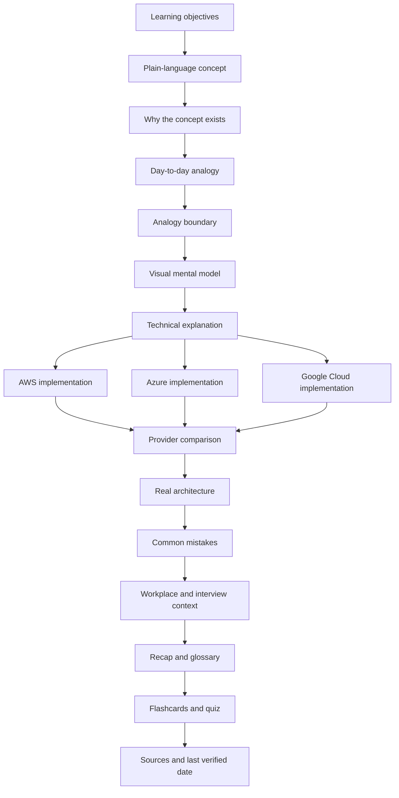
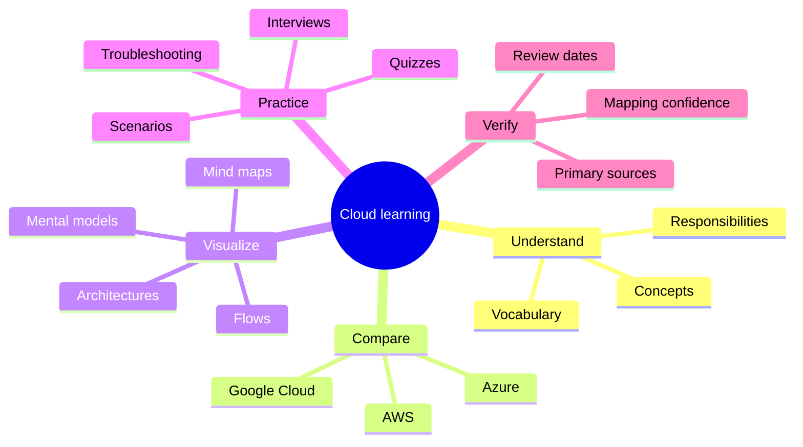
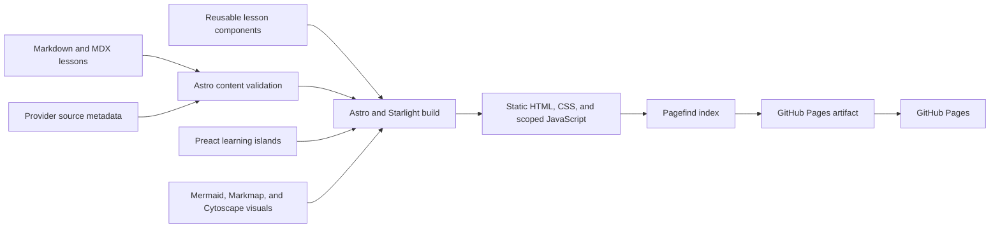
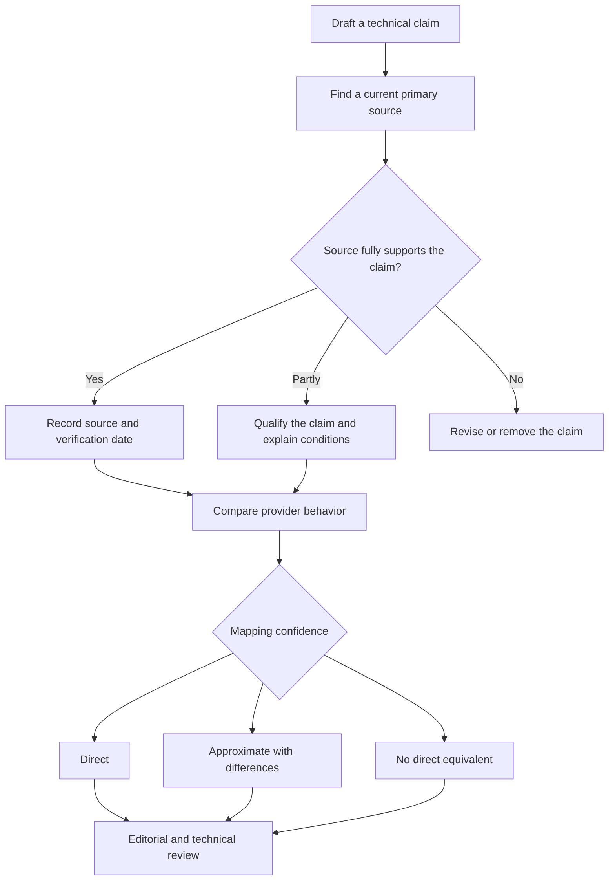
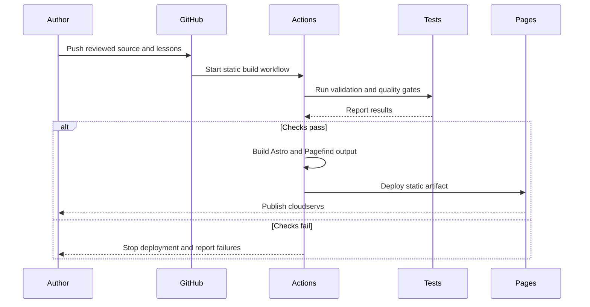

# cloudservs

Last documentation sync: `2026-07-22T15:07:30-04:00`

> Learn cloud concepts once, then understand how AWS, Microsoft Azure, and Google Cloud implement them.

```text
                         cloudservs
                              |
               Learn the vendor-neutral concept
                              |
          +-------------------+-------------------+
          |                   |                   |
          v                   v                   v
         AWS                Azure                GCP
          |                   |                   |
          +-------------------+-------------------+
                              |
                    Compare the differences
                              |
                              v
               Apply the idea in real systems
```

`cloudservs` is a visual learning platform for beginners who need to understand cloud computing across the three major providers. It is designed for students, recent graduates, career changers, and early-career professionals preparing for cloud-related jobs.

The project is built as a static website for deployment through GitHub Pages.

## Project status

Current public release: `v1`, released July 21, 2026. The next validated learner-facing syllabus addition, feature, or resolved website bug will be recorded in `v2`. Documentation-only work performed after v1 does not increment the version.

The detailed, evidence-based release history is available in [`changelog.md`](./changelog.md).

Development is active. The first implementation chunk is available and includes:

- A custom responsive Astro and Starlight interface
- Persisted light, dark, and system theme choices
- Static Pagefind full-text search across rendered lesson text
- One ordered nine-module curriculum model
- Local lesson progress and an encouraging completion control
- Accessible knowledge checks with answer explanations
- Reusable ASCII, Mermaid, Markmap, and provider-comparison components
- Whole-diagram zoom, reset, scrolling, and native full-screen viewing controls
- A working Start now curriculum action that opens the first available lesson
- Locally bundled Atkinson Hyperlegible, Manrope, and JetBrains Mono typography
- Reliable ASCII copying with a restricted-browser fallback
- Centered ASCII drawings and fixed-height learning cards across both toolkit rows
- Equal-height provider comparison cards with aligned edges
- Equal-height diagram controls with optically centered SVG zoom icons
- A persisted desktop contents pane that can move left or right and resize like a split view
- Higher-contrast, larger Markmap labels in light and dark themes
- Playwright production-build regression tests for shared layout and interaction fixes
- Shareable heading chain links that copy complete section URLs with accessible confirmation
- A validated 93-lesson syllabus ledger with durable checkpoints and next-work reporting
- Enforced whole-module quality audits at 25%, 50%, 75%, and 100% topic coverage
- An append-only, timestamped `audit.md` history for completed module checkpoints
- A detailed, append-only `lessons_learned.md` post-mortem with beginner explanations, diagrams, evidence, limitations, and prevention steps
- A detailed `changelog.md` that separates released features from planned, deferred, and installed-but-unused capabilities
- Two detailed, source-backed foundation lesson drafts
- GitHub Pages base-path configuration and an automated deployment workflow
- A zero-analytics privacy policy, disabled Astro CLI telemetry, build-time privacy scanning, and a browser test that rejects third-party requests

The first detailed lesson drafts are **What is cloud computing?** and **Shared responsibility**. Their technical claims were checked against current NIST, AWS, Microsoft, and Google primary sources on July 21, 2026. The syllabus ledger separately records the remaining whole-lesson requirements before either draft is quality-gated as complete.

Core repository documents:

- `AGENTS.md` defines the project's non-negotiable requirements and engineering standards.
- `SKILLS.md` defines repeatable workflows for content, diagrams, fact-checking, search, accessibility, testing, and deployment.
- `audit.md` preserves timestamped module-audit outcomes, evidence, corrections, validation results, and next actions.
- `lessons_learned.md` preserves questions, corrections, successful ideas, limitations, visual causal models, and future practices learned by Aman and Codex. It is updated during every work-session closeout, including a short record when no new reusable lesson emerges.
- `changelog.md` records public versions, learner-facing syllabus additions, implemented features, verified website fixes, quality evidence, technology status, and known limitations. It must be updated in the same change whenever one of those qualifying product changes is completed. It is not edited for routine questions or documentation-only clarification.
- `readme.md` describes the product vision, learning experience, architecture, curriculum, and delivery plan.

### Honest v1 boundary

| Area                  | Implemented in v1                                              | Still planned or deferred                                     |
| --------------------- | -------------------------------------------------------------- | ------------------------------------------------------------- |
| Curriculum            | 93-lesson ledger, 9 modules, 2 detailed foundation drafts      | Remaining lessons and full quality completion                 |
| Search                | Static Pagefind full-text index                                | Advanced filters and complete synonym translation             |
| Progress              | Local lesson-completion toggle                                 | Bookmarks, recently viewed, and continue-learning automation  |
| Visuals               | ASCII, Mermaid, Markmap, and provider comparisons              | Released Cytoscape graphs and Chart.js visualizations         |
| Learning interactions | Knowledge checks, hints, explanations, and retry               | Flashcard component and larger quiz system                    |
| Accessibility checks  | Semantic controls, keyboard behavior, reduced motion, contrast | axe-core integration and multi-browser assistive review       |
| Browser tests         | 8 desktop Chromium regressions                                 | Dedicated mobile, Firefox, and WebKit projects                |
| Keyboard search label | Starlight search shortcut behavior                             | Repository implementation of a platform-aware Command K label |
| Offline use           | Static site delivery                                           | Installable PWA, deferred for Astro 7 compatibility           |
| Optional libraries    | Packages installed                                             | Chart.js, Cytoscape.js, and Driver.js learner-facing use      |

### Evidence-based status promise

Project status is based on the current repository, not on conversational memory. This rule exists because the platform-aware Command K label was once confirmed in conversation even though no platform-detection implementation existed. The confirmation was incorrect, and the capability remains planned.

```text
Status claim
    |
    +--> implementation located
    +--> real page or workflow reaches it
    +--> relevant behavior verified
    +--> test and environment limits stated
    |
    v
Safe to call verified
```

The project uses these status terms consistently:

| Status                     | Meaning                                                           |
| -------------------------- | ----------------------------------------------------------------- |
| Planned                    | Requested or documented, but no implementation evidence exists    |
| Present but inactive       | Code or a dependency exists, but the product does not use it      |
| Implemented but unverified | Reachable code exists, but the behavior has not been demonstrated |
| Verified                   | Current implementation and relevant behavior have fresh evidence  |
| Released                   | Verified behavior is part of a named public release               |
| Not yet verified           | Available evidence is insufficient for a reliable positive answer |

A previous response, installed dependency, requirement document, or unrelated passing test cannot promote a capability to verified. Platform-specific claims require evidence for each differing branch. Therefore Command K on macOS must not be described as implemented until platform detection, macOS and non-macOS expectations, automated branch coverage, and a browser check all exist.

## Run the website locally

```bash
npm install
npm run dev
```

Open `http://localhost:4321/cloudservs/`. The repository base path is part of the local URL so navigation behaves like the GitHub Pages deployment.

Before publishing a chunk, run:

```bash
npm test
npm run syllabus:validate
npm run syllabus:status
npm run docs:validate
npm run privacy:validate
npm run build
npm run test:e2e
npm run format:check
```

The production build validates the syllabus and required documentation synchronization, generates static HTML, Pagefind's browser-side search index, a sitemap, and the GitHub Pages artifact in `dist/`, then scans that artifact for privacy regressions.

## Privacy: no learner analytics or tracking

`cloudservs` does not collect learner data for analytics. The application has no analytics service, telemetry endpoint, advertising tag, account system, form receiver, database, or application server. It does not send lesson activity, searches, progress, theme choices, quiz answers, or layout preferences to the project owner.

This conclusion was checked against the authored source, direct and transitive dependencies, generated production HTML, browser storage calls, network-capable browser APIs, remote resource references, and representative browser requests on July 22, 2026.

### What the audit found

| Area                        | Current behavior                                                  | Privacy meaning                                                                                                                  |
| --------------------------- | ----------------------------------------------------------------- | -------------------------------------------------------------------------------------------------------------------------------- |
| Visitor analytics           | None                                                              | No Google Analytics, tag manager, Plausible, Matomo, PostHog, Mixpanel, Hotjar, session replay, or equivalent service is present |
| Accounts and forms          | None                                                              | No learner identity, email address, profile, comment, or submitted answer is accepted                                            |
| Cookies                     | None written or read by cloudservs                                | The application does not use cookies for tracking or preferences                                                                 |
| Search                      | Static Pagefind search in the browser                             | Typed search terms are not sent to a cloudservs search server                                                                    |
| Preferences                 | Local browser storage only                                        | Theme, progress, and contents-pane settings stay on that device and browser                                                      |
| Clipboard                   | Writes only after a learner clicks Copy                           | The site copies the requested diagram text or section URL and does not read unrelated clipboard contents                         |
| Fonts and scripts           | Bundled into the static site                                      | No remote font, analytics script, or third-party iframe is loaded                                                                |
| Astro development telemetry | Package exists transitively, but telemetry is explicitly disabled | npm lifecycle commands and GitHub Actions opt out before Astro development and build commands run                                |
| Hosting                     | Static files on GitHub Pages                                      | GitHub, not cloudservs, processes the network request needed to serve each page                                                  |

The curriculum includes a future subject called data engineering and analytics. That means teaching cloud data systems. It does not mean analyzing visitors to this website.

### Local storage is not data collection

The site remembers a small amount of non-sensitive state in the learner's browser so useful choices survive navigation or a later visit.

```text
Learner chooses a theme, completes a lesson, or moves the contents pane
                              |
                              v
                  Saved inside that browser
                              |
                +-------------+-------------+
                |                           |
                v                           v
       Used on a later visit       Never sent to cloudservs
```

| Browser key                    | Storage         | Value and purpose                              | Sent anywhere by cloudservs? |
| ------------------------------ | --------------- | ---------------------------------------------- | ---------------------------- |
| `starlight-theme`              | Local storage   | Selected light, dark, or automatic theme       | No                           |
| `cloudservs:completed-lessons` | Local storage   | Lesson slugs the learner marked complete       | No                           |
| `cloudservs:toc-width`         | Local storage   | Preferred desktop contents-pane width          | No                           |
| `cloudservs:toc-side`          | Local storage   | Preferred left or right contents-pane position | No                           |
| `sl-sidebar-state`             | Session storage | Temporary expanded or collapsed sidebar state  | No                           |

Local storage stays with that browser profile. It does not create an account, does not synchronize between devices, and is not available to the project owner. A learner can remove it through the browser's clear site data control. Clearing it resets the saved theme, lesson completion marks, and layout preferences.

### The GitHub Pages boundary

An honest privacy explanation must separate application behavior from hosting behavior:

```text
Browser
   |
   | HTTPS request, required to load a page
   v
GitHub Pages infrastructure
   |
   +--> serves cloudservs static files
   +--> GitHub documents security logging of visitor IP addresses
   |
   v
cloudservs runs locally in the browser
   |
   +--> no cloudservs analytics endpoint
   +--> no learner database
   +--> no project-owner visitor dashboard
```

GitHub's official Pages documentation states that a visitor's IP address is logged and stored by GitHub for security purposes. That is infrastructure processing by the hosting provider, not analytics implemented or received by cloudservs. See [GitHub's explanation of Pages data collection](https://docs.github.com/en/pages/getting-started-with-github-pages/what-is-github-pages#data-collection) and the linked GitHub privacy statement. External AWS, Microsoft, Google, NIST, and GitHub links also lead to sites with their own privacy practices after the learner chooses to leave cloudservs.

### Safeguards against future regression

- `scripts/run-astro-private.ts` launches every project Astro command with `ASTRO_TELEMETRY_DISABLED=1` without changing a contributor's machine-wide settings.
- The development, check, production-build, and preview npm commands all use that launcher.
- GitHub Actions sets `ASTRO_TELEMETRY_DISABLED=1` for the entire deployment job.
- `npm run privacy:validate` rejects common network collection APIs, cookie access, analytics packages, known tracking markers, and automatically loaded remote scripts, frames, styles, or media.
- The production build runs the privacy validator after generating `dist/`.
- Playwright visits representative learner pages and fails if the browser requests a third-party origin.
- Every new dependency, browser API, embedded resource, storage key, and hosting change requires manual privacy review because automated keyword scans cannot recognize every possible future tracking mechanism.

Pagefind's official documentation describes it as a fully static browser search with no server component. See the [Pagefind documentation](https://pagefind.app/docs/). Astro documents its telemetry opt-out in the [Astro CLI reference](https://docs.astro.build/en/reference/cli-reference/#astro-telemetry).

## Durable syllabus progress

Long-running curriculum development is tracked in `src/data/syllabus.ts`. The ledger currently contains 93 ordered lessons across all nine modules. Each lesson records its stable ID, topics, covered topics, prerequisites, workflow status, source path, completed quality requirements, verification date, status history, next action, and blocker when applicable.

```text
Conversation request
       |
       v
"continue making syllabus"
       |
       v
Validate the repository ledger
       |
       v
Read the generated status report
       |
       v
Resume the earliest ready lesson and its next step
       |
       v
Update evidence, history, and the next checkpoint
```

Use these commands at the beginning and end of a curriculum session:

```bash
npm run syllabus:validate
npm run syllabus:status
```

The report deliberately separates topic coverage from complete lesson quality. It also confirms the audit log and shows the completion date for every finished checkpoint. A published lesson may contain verified claims while still needing glossary, flashcard, architecture, accessibility, or review work. File existence and navigation visibility never count as completion by themselves.

### Module quality checkpoints

Every module carries four audit records:

```text
0% -------- 25% -------- 50% -------- 75% -------- 100%
               |            |            |             |
               v            v            v             v
            Audit 1      Audit 2      Audit 3       Final audit
```

Reaching a threshold blocks syllabus validation until the audit is complete. Each audit checks syllabus coverage, factual accuracy, primary-source quality, beginner pedagogy, lesson sequence, provider comparisons, visual quality, accessibility, navigation, search, browser regressions, terminology, and consistency. Completed audits cannot contain open findings. They must also have a matching timestamped entry in `audit.md`, or validation and the production build fail.

Module 1 has already crossed 25%. Its first audit was completed on July 21, 2026. The review confirmed the current foundation claims against NIST and official AWS, Microsoft, and Google Cloud sources, corrected premature completion wording, installed durable tracking, and converted unfinished lesson sections into explicit next steps.

## Current source structure

```text
cloudservs/
  audit.md                       Append-only module audit history
  changelog.md                   Evidence-based public feature history
  lessons_learned.md             User and Codex post-mortem history
  .github/workflows/static.yml   GitHub Pages build and deployment
  scripts/                       Syllabus validation and status commands
  public/                        Static favicon and public assets
  src/assets/                    Brand artwork
  src/components/                Learning and diagram components
  src/content/docs/              Curriculum pages and lessons
  src/data/                      Ordered curriculum data and tests
  src/stores/                    Persisted learner progress
  src/styles/                    Custom visual system
  astro.config.mjs              Site, base path, navigation, and theme setup
  package.json                  Exact development and runtime dependencies
```

## The problem

A beginner entering the workforce is often expected to recognize services from AWS, Azure, and Google Cloud. This is difficult because the learner faces two problems at the same time:

1. They must understand cloud concepts such as compute, storage, networking, identity, databases, observability, and reliability.
2. They must learn three different product vocabularies and understand where the services behave differently.

Learning each provider separately often produces repetition and fragmented knowledge.

```text
Traditional approach

AWS course                 Azure course               GCP course
    |                           |                          |
    v                           v                          v
Learn compute again        Learn compute again       Learn compute again
Learn storage again        Learn storage again       Learn storage again
Learn networking again     Learn networking again    Learn networking again
    |                           |                          |
    +---------------------------+--------------------------+
                                |
                                v
                    Repetition and terminology confusion
```

## The cloudservs approach

`cloudservs` teaches the underlying concept first. It then shows how each provider expresses that concept, where the products are similar, and where they are meaningfully different.

```text
Concept-first approach

                    Learn one cloud concept deeply
                               |
              +----------------+----------------+
              |                |                |
              v                v                v
        AWS expression   Azure expression   GCP expression
              |                |                |
              +----------------+----------------+
                               |
                               v
              Compare behavior, scope, and tradeoffs
                               |
                               v
                   Practice a realistic scenario
```

The guiding principle is:

> Teach the idea once. Compare the providers honestly. Apply the knowledge visually.

## Who this is for

- Beginners learning cloud computing for the first time
- Students and recent graduates preparing to enter the workforce
- Career changers moving into cloud, DevOps, security, data, or software roles
- Professionals who know one provider and need to translate their knowledge to another
- Learners preparing for interviews or entry-level cloud responsibilities
- Anyone who benefits from diagrams, analogies, structured comparisons, and mental models

## Learning philosophy

The website will be beginner-friendly without cutting technical depth. Long explanations will be organized carefully instead of shortened until they lose value.

Every substantial lesson will answer:

- What is this concept?
- Why does it exist?
- What problem does it solve?
- What does it resemble in day-to-day life?
- Where does that analogy stop being accurate?
- How does it work technically?
- How does AWS implement it?
- How does Azure implement it?
- How does Google Cloud implement it?
- Are the provider services direct equivalents?
- How does the concept appear in a real architecture?
- What mistakes do beginners make?
- How could this appear at work or in an interview?
- What should the learner remember?

## Standard lesson journey



## A simple lesson example

A beginner learning load balancing might first see a restaurant analogy:

```text
Customers enter a busy restaurant
              |
              v
        Host at the entrance
       /          |          \
      v           v           v
 Server A      Server B      Server C

The host distributes customers so that one server is not overwhelmed.
```

The technical model follows:

```text
Client requests
      |
      v
Load balancer
   |     |     |
   v     v     v
App 1  App 2  App 3
   \     |     /
    \    |    /
     v   v   v
Shared data services
```

The lesson would then explain routing algorithms, health checks, Layer 4 and Layer 7 behavior, session persistence, scaling, failure handling, and provider implementations. The analogy introduces the idea, but it does not replace the technical explanation.

## Diagram-first learning

The website will use many purposeful visuals throughout the curriculum:

- Markdown-formatted ASCII diagrams
- Interactive mind maps
- Concept maps
- Architecture diagrams
- Flow diagrams
- Sequence diagrams
- Decision trees
- Request and data-flow diagrams
- Network paths
- Responsibility boundaries
- Service relationship graphs
- Failure and recovery flows
- Lifecycle diagrams
- Before-and-after comparisons
- Side-by-side provider mappings
- Interview mental models



Visuals will always include a title, explanation, and accessible text equivalent. Meaning will never depend on color alone. Interactive visuals will support keyboard use, readable focus states, reduced motion, and mobile layouts.

## Provider mapping confidence

Similar service categories do not guarantee identical products. Every comparison will identify the confidence of the mapping.

```text
Provider service comparison
            |
            v
    Is the primary purpose similar?
          /                 \
        No                   Yes
        |                     |
        v                     v
No direct equivalent    Is behavior closely comparable?
                              /              \
                            Yes               No
                             |                 |
                             v                 v
                     Direct mapping     Approximate mapping
                                              |
                                              v
                                 Explain important differences
```

- **Direct mapping:** The services have closely comparable primary purposes and behavior.
- **Approximate mapping:** The services solve a similar problem but have meaningful differences.
- **No direct equivalent:** The provider uses a different service, combination of services, or architecture.

## Planned experience

### Guided learning

- Visible prerequisites
- Beginner, intermediate, and advanced depth indicators
- One clear, ordered curriculum
- Clear lesson objectives
- Continue-learning entry point
- Locally saved progress
- Recently viewed lessons
- Bookmarks
- Subtle completion feedback

### Active learning

- Knowledge checks inside lessons
- Flashcards
- Full quizzes
- Scenario-based questions
- Architecture decision exercises
- Troubleshooting exercises
- Interview questions
- Explanations for correct and incorrect answers
- Hints before answer reveals where appropriate

### Reference tools

- Searchable cloud glossary
- AWS, Azure, and Google Cloud terminology translator
- Side-by-side service comparisons
- Frequently confused concepts
- Architecture pattern library
- Printable revision sheets
- Source links and verification dates

## Search

Search is a core feature and will use Pagefind, which works with static GitHub Pages output.

```text
Learner query
   |
   +-- Concept name
   +-- Abbreviation
   +-- AWS term
   +-- Azure term
   +-- GCP term
   +-- Job task
          |
          v
 Reviewed synonym mapping
          |
          v
    Static Pagefind index
          |
          v
Lessons, sections, glossary terms, and comparisons
          |
          v
Provider, curriculum module, topic, and difficulty filters
```

Planned search behavior:

- Full-text search across lesson content
- Section-level results for long lessons
- Highlighted matches and useful excerpts
- Provider, curriculum-module, domain, and difficulty filters
- Support for abbreviations and common synonyms
- Cross-provider terminology discovery
- Keyboard-friendly search dialog
- Accessible focus and announcement behavior
- Helpful empty states
- Automatic indexing during deployment
- No backend or hosted search service required

## User interface and visual design

The interface will be calm, polished, responsive, and optimized for long-form learning.

### Visual principles

- Comfortable reading width
- Clear content hierarchy
- Generous spacing
- Consistent lesson and diagram cards
- Provider identification through text, icon, and color
- Large touch targets
- Strong visible focus states
- Minimal layout shift
- Purposeful motion only
- No visually noisy or pressure-based gamification

### Theme behavior

```text
First visit
    |
    v
Read operating system theme preference
    |
    +-- Light preference --> Use light theme
    |
    +-- Dark preference ---> Use dark theme

Learner uses theme toggle
    |
    v
Save explicit choice locally
    |
    v
Restore it on later visits
```

The site will support light mode, dark mode, system-preference detection, persisted learner choice, accessible contrast, theme-aware diagrams, reduced motion, keyboard navigation, and responsive layouts.

## JavaScript and content stack

The site uses a static-first architecture. The status column prevents an installed or planned library from being mistaken for a released feature.

| Technology             | Intended responsibility                                      | v1 evidence status                                |
| ---------------------- | ------------------------------------------------------------ | ------------------------------------------------- |
| Astro                  | Static generation and GitHub Pages output                    | Active                                            |
| Starlight              | Curriculum layout, navigation, theme, and search integration | Active                                            |
| Markdown and MDX       | Lessons with reusable interactive components                 | Active                                            |
| Preact                 | Focused interactive learning components                      | Active for quizzes, progress, and toolkit         |
| Pagefind               | Static full-text search                                      | Active for production indexing                    |
| Mermaid                | Flow and architecture diagrams                               | Active                                            |
| Markmap                | Interactive Markdown mind maps                               | Active                                            |
| Cytoscape.js           | Service relationship and prerequisite graphs                 | Installed, no released v1 use                     |
| Lucide                 | Generic interface icons                                      | Active                                            |
| Nano Stores Persistent | Local learner state                                          | Active for lesson completion                      |
| Vite PWA               | Future offline installation                                  | Not installed, deferred for Astro 7 compatibility |
| Chart.js               | Quantitative visuals with table alternatives                 | Installed, no released v1 use                     |
| Driver.js              | Optional first-visit guidance                                | Installed, no released v1 use                     |
| Expressive Code        | Code examples, command blocks, and styled text blocks        | Active through Starlight                          |
| TypeScript             | Typed components, data, and validation                       | Active                                            |
| Vitest                 | Unit testing                                                 | Active                                            |
| Playwright             | Production browser regression testing                        | Active for desktop Chromium                       |
| axe-core               | Automated accessibility checks                               | Installed, not invoked by the v1 browser suite    |

Libraries will be used generously when they add learning value. Overlapping dependencies will be avoided. Heavy libraries will be loaded only on pages that need them so a text lesson does not pay the performance cost of every visualization tool. Installation alone never counts as a released feature.

The deployment workflow installs Chromium and runs the Playwright UI regression suite before uploading the GitHub Pages artifact. A known shared-layout or interaction regression therefore blocks deployment.

## Planned system architecture



Offline installation is intentionally deferred. The evaluated Vite PWA Astro adapter does not declare compatibility with Astro 7, which is required by the current Starlight release. The project will not force an incompatible peer dependency. PWA support will be reconsidered when the adapter declares compatibility and its GitHub Pages base-path behavior can be verified.

```text
Most lesson content              Interactive learning component
       |                                      |
       v                                      v
Static HTML and CSS                    Focused Preact island
       |                                      |
       +-- Fast first display                 +-- Quiz
       +-- Search readable                    +-- Flashcard
       +-- Works without a server             +-- Mind map
       +-- Minimal JavaScript                 +-- Service graph
                                              +-- Progress control
```

## Branding and icons

`cloudservs` will have an original, vendor-neutral SVG logo.

The proposed visual idea combines three connected provider nodes, a cloud or layered shape, an open-book reference, a lowercase `cloudservs` wordmark, and theme-aware colors.

```text
          Provider
             o
            / \
           /   \
          o-----o
     Provider  Provider
          \     /
           \   /
        [ open book ]
         cloudservs
```

Icon rules:

- Use official provider architecture icons where published guidelines permit.
- Do not invent altered versions of provider trademarks.
- Create original concept icons for compute, storage, networking, identity, security, data, reliability, and other vendor-neutral topics.
- Use Lucide for common interface actions.
- Pair unfamiliar icons with text labels.
- Optimize SVG assets and test them in both themes.

## Fact-checking and source policy

Accuracy is a release requirement.



Primary sources will include official AWS documentation, Microsoft Learn and Azure documentation, official Google Cloud documentation, and original documentation for vendor-neutral projects and standards.

Every technical lesson will include source links and a last-verified date. Time-sensitive information such as prices, quotas, availability, product names, and certification details will receive additional review. Search-result snippets, unsourced comparison articles, and assumptions will not be treated as authoritative evidence.

## Curriculum

The curriculum is intended to be broad enough for serious job preparation. It will grow in reviewed chunks rather than through shallow placeholder pages.

| Area                             | Topics                                                                                                                                                             |
| -------------------------------- | ------------------------------------------------------------------------------------------------------------------------------------------------------------------ |
| Computing and cloud foundations  | Service models, deployment models, control plane, data plane, elasticity, scalability, availability, durability, reliability, economics, and shared responsibility |
| Identity and access              | Users, groups, roles, policies, service identities, authentication, authorization, least privilege, federation, temporary credentials, and workload identity       |
| Global infrastructure            | Regions, zones, edge locations, data residency, latency, multi-zone design, multi-region design, and regional failures                                             |
| Compute                          | Virtualization, virtual machines, images, sizing, autoscaling, placement, spot capacity, dedicated hosts, metadata, patching, and batch computing                  |
| Containers                       | Images, registries, runtimes, networking, storage, configuration, secrets, security, orchestration, and use-case selection                                         |
| Kubernetes                       | Clusters, nodes, pods, deployments, services, namespaces, ingress, storage, health checks, scheduling, scaling, networking, and security                           |
| Serverless                       | Functions, triggers, event sources, cold starts, statelessness, concurrency, retries, idempotency, orchestration, cost, and tradeoffs                              |
| Storage                          | Object, block, and file storage, classes, tiers, replication, versioning, lifecycle, encryption, temporary access, backup, and archival                            |
| Databases                        | Relational, document, key-value, graph, time-series, and wide-column models, transactions, indexes, replication, backups, scaling, and migration                   |
| Networking fundamentals          | IP, CIDR, IPv4, IPv6, ports, TCP, UDP, DNS, routing, NAT, firewalls, proxies, VPNs, packet flow, and troubleshooting                                               |
| Cloud networking                 | Virtual networks, subnets, routes, gateways, firewall rules, private endpoints, peering, transit, hybrid connectivity, load balancing, and flow logs               |
| Application delivery             | Domains, DNS, TLS, reverse proxies, Layer 4, Layer 7, health checks, CDNs, web application firewalls, API gateways, caching, and global traffic                    |
| Messaging and integration        | Queues, publish and subscribe, event buses, streams, consumer groups, dead-letter queues, ordering, delivery guarantees, retries, and workflows                    |
| Security                         | Defense in depth, zero trust, encryption, keys, secrets, certificates, vulnerability scanning, threat detection, audit logs, data protection, and incidents        |
| Observability and operations     | Metrics, logs, traces, dashboards, alerts, performance monitoring, SLI, SLO, SLA, error budgets, on-call work, root cause analysis, and runbooks                   |
| Reliability and recovery         | Fault tolerance, redundancy, RTO, RPO, backups, restore tests, active-active, active-passive, retries, backoff, circuit breakers, and graceful degradation         |
| DevOps and delivery              | Source control, branching, CI/CD, artifacts, environments, configuration, feature flags, release strategies, rollbacks, GitOps, and supply-chain security          |
| Infrastructure as code           | Declarative configuration, state, modules, variables, dependencies, drift, planning, secrets, Terraform, native tools, testing, and safe deployment                |
| Cost management and FinOps       | Pricing models, compute, storage, network, egress, commitments, spot capacity, rightsizing, budgets, allocation, forecasting, and unit economics                   |
| Governance and organization      | Accounts, subscriptions, projects, folders, resource hierarchy, naming, tags, policies, landing zones, centralized services, and compliance                        |
| Data engineering and analytics   | Lakes, warehouses, lakehouses, ETL, ELT, batch, streaming, pipelines, ingestion, catalogs, governance, query engines, and business intelligence                    |
| AI and machine learning          | Training, inference, models, datasets, endpoints, managed AI, generative AI, embeddings, vector search, retrieval, monitoring, privacy, and cost                   |
| Migration and modernization      | Assessment, dependency discovery, migration strategies, database migration, transfer, hybrid operation, cutover, rollback, and optimization                        |
| Architecture patterns            | Three-tier, microservices, events, serverless, static sites, APIs, batch, streams, SaaS, caching, saga, CQRS, and multi-region systems                             |
| Hands-on job skills              | Consoles, command-line tools, logs, permissions, network diagnosis, deployments, databases, monitoring, backups, cost estimation, and incident response            |
| Interview and career preparation | Concept questions, comparisons, troubleshooting, architecture scenarios, security, cost, behavioral questions, whiteboards, resumes, and portfolios                |

## One ordered curriculum

`cloudservs` will use one curriculum, one lesson sequence, and one progress model. It will not duplicate lessons for different professions or maintain separate role-based paths.

Workplace relevance can still be explained inside a lesson. For example, an identity lesson may describe why administrators, developers, security professionals, and architects encounter the topic. That context does not create a separate course.

```text
Start
  |
  v
Module 1: Cloud and computing foundations
  |
  v
Module 2: Identity, infrastructure, compute, storage, and databases
  |
  v
Module 3: Networking and application delivery
  |
  v
Module 4: Containers, Kubernetes, serverless, and messaging
  |
  v
Module 5: Security, observability, reliability, and operations
  |
  v
Module 6: DevOps, infrastructure as code, cost, and governance
  |
  v
Module 7: Data, analytics, AI, migration, and modernization
  |
  v
Module 8: Architecture patterns and integrated scenarios
  |
  v
Module 9: Hands-on job skills and interview preparation
  |
  v
Curriculum completion
```

Learners can search, revisit, or jump to a lesson when needed, but the site will always make the recommended curriculum order and prerequisites clear.

## Code documentation standard

The codebase is intended to be readable by beginners.

- Every meaningful human-authored line will be documented when the language and readability permit it.
- When line-by-line comments are impractical, every logical block will receive an adjacent explanation.
- File headers will explain purpose and data flow.
- Components will document inputs, state, events, persistence, and accessibility behavior.
- CSS will document important theme, responsive, calculation, and motion decisions.
- Comments will explain intent and reasoning, not merely repeat syntax.
- Formats that do not allow comments, such as JSON, will be documented in nearby Markdown or adjacent source configuration.
- Generated files, lockfiles, third-party source, official vendor assets, and build output are exempt.

Clear naming and small components remain the first line of documentation.

## Accessibility target

The project will target WCAG 2.2 AA and combine automated and manual testing.

```text
Accessibility review
       |
       +-- Semantic HTML
       +-- Keyboard navigation
       +-- Visible focus
       +-- Screen-reader names and announcements
       +-- Color contrast
       +-- Text zoom and reflow
       +-- Reduced motion
       +-- Touch target size
       +-- Diagram alternatives
       +-- Light and dark themes
       |
       v
Automated checks + manual review + browser testing
```

## Incremental delivery plan

Quality will be protected by delivering complete chunks.

### Chunk 1: Platform foundation

- Astro and Starlight project structure
- Custom `cloudservs` design system
- Original logo, favicon, and concept-icon foundation
- Responsive navigation
- Light and dark themes
- Content schema and validation
- Pagefind search
- Progress and bookmark storage
- Reusable lesson and diagram components
- GitHub Pages workflow
- Test and accessibility foundation

### Chunk 2: Pilot curriculum

- Cloud fundamentals
- Global infrastructure
- Shared responsibility
- Compute
- Storage
- Networking
- Identity and access management

Every pilot lesson will establish the full explanation, diagram, comparison, sourcing, review, and quiz standard.

### Chunk 3: Core technical curriculum

- Databases
- Containers
- Kubernetes
- Serverless
- Load balancing and DNS
- Messaging
- Observability
- Security
- Scaling, reliability, and cost

### Chunk 4: Curriculum completion and integration

- Complete the remaining detailed curriculum areas
- Connect concepts through cross-topic architecture scenarios
- Add prerequisite and previous and next lesson relationships
- Strengthen curriculum progress and continue-learning behavior
- Review the complete curriculum for gaps and unnecessary repetition

### Chunk 5: Job preparation

- Interview questions
- Architecture scenarios
- Troubleshooting exercises
- Flashcards
- Revision tools
- Portfolio project guidance

### Chunk 6: Advanced curriculum

- Governance
- Migration
- Disaster recovery
- Infrastructure as code
- Data engineering
- AI services
- Multi-cloud architecture patterns
- Ongoing content-review automation

## Quality gates

A chunk is complete only after:

- Content metadata validation
- Primary-source fact-checking
- Mapping-confidence review
- Editorial review
- Diagram review in both themes
- Mobile and desktop visual review
- Formatting, linting, and type checking
- Unit and component tests
- Production build
- Search indexing tests
- Playwright browser tests
- axe-core accessibility checks
- Manual keyboard review
- Reduced-motion review
- Internal and external link checks
- GitHub Pages base-path testing
- Privacy validation against source, dependencies, and generated HTML
- Browser confirmation that representative pages make no third-party requests
- Astro CLI telemetry opt-out in local npm workflows and GitHub Actions
- Copyright verification
- Em dash scan
- Documentation update
- Changelog verification against source, tests, content state, and dependency usage
- Four-document living-guide synchronization validation
- Release-only changelog review without routine timestamp churn

## GitHub Pages deployment model



The deployed site will not require a private server, database, or server-side runtime. Learning progress remains in the learner's browser and is not transmitted by cloudservs. GitHub Pages still handles the page request and applies GitHub's own documented security logging at the hosting boundary.

## Repository safety and accidental-file recovery

Project commands must preserve user work and make accidental side effects visible. Shell searches use careful quoting because characters such as `>`, `<`, `|`, brackets, and wildcards can be interpreted by the shell instead of passed to the search program.

If a command reports a quoting, parsing, redirection, or path error:

```text
Command error
     |
     v
Inspect Git status immediately
     |
     v
Inspect unexpected path, size, timestamp, and history
     |
     v
Explain the cause and ask before deletion
     |
     v
Remove only the confirmed path
     |
     v
Validate and record the reusable lesson
```

An accidental empty file named `]+` was created on July 22, 2026 when a malformed inspection command allowed the shell to interpret part of a regular expression as output redirection. It was not used by the website. After its origin and Git history were verified, it was removed with the owner's authorization. The incident is preserved in `lessons_learned.md` so future contributors understand both the cause and the safer recovery process.

This repository-only cleanup does not create a changelog release. The changelog is reserved for validated learner-facing syllabus additions, features, and resolved website bugs.

## Copyright

© 2026 Aman Ali Pogaku
